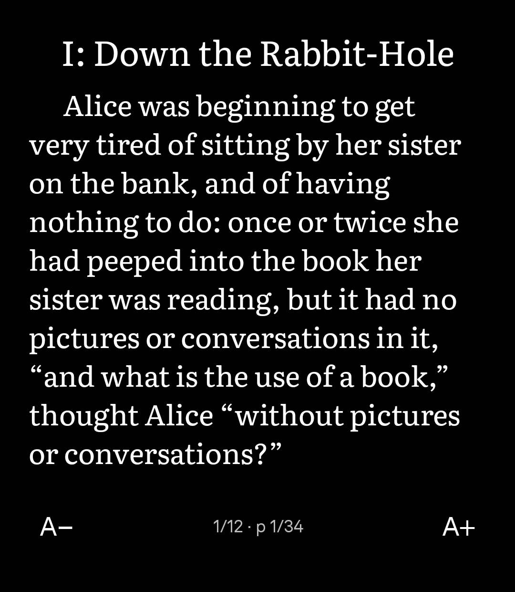
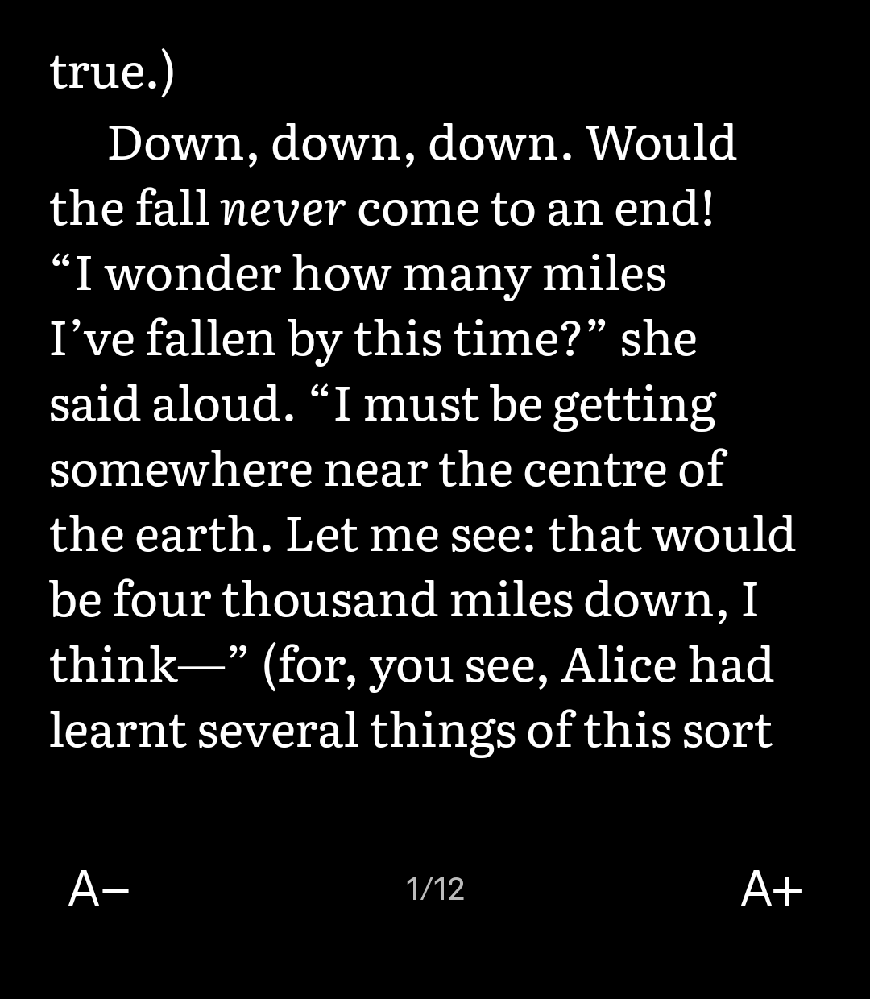
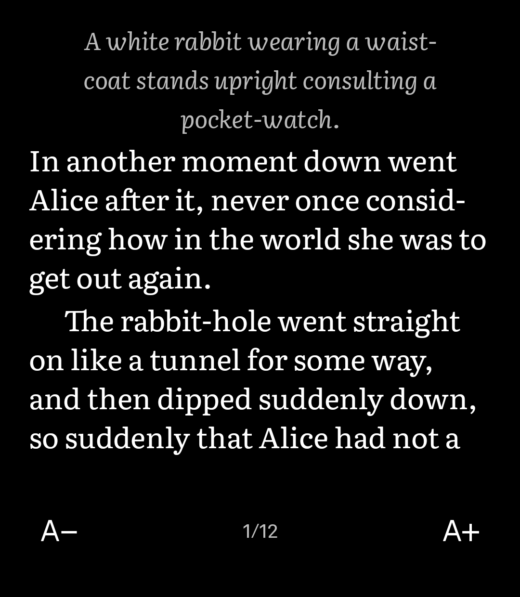

# Reader

Read DRM-free EPUB books on your Light Phone.

Books from Project Gutenberg and Standard Ebooks are built in, or add your own catalogue.
Tap or press a volume key to turn the page. Your place is kept, at any text size.
Works offline, with no account and nothing tracked. Copy-protected books from Kindle, Apple Books or Libby won't open.

> **Status: early development (0.1.0).** Today's build opens one bundled test book (Alice's Adventures in
> Wonderland from Standard Ebooks), turns pages by tap or volume key, and keeps your place across text
> sizes. The Shelf, Catalogues, table of contents and saved reading position are being built next. Not yet
> signed or listed by Light. A Light Phone III tool built on [Light's SDK](https://github.com/lightphone/light-sdk).

<p>
  
  
  
</p>

<sub>On a Light Phone III, from an early build. Book text is set in Literata; illustrations appear as their
descriptions for now.</sub>

## Where to find DRM-free books

[Standard Ebooks](https://standardebooks.org), [Project Gutenberg](https://www.gutenberg.org),
Tor Publishing, Kobo's DRM-free titles, Humble Bundle, Smashwords, and most independent presses.

## Add your own catalogue (planned)

Catalogues arrive with the Shelf; this is how they are designed to work. Any OPDS catalogue will work
(Calibre's content server, calibre-web, Kavita). It must be served over
**https** with a certificate your phone already trusts, which means a public one. Routes that work:
Tailscale Funnel, Cloudflare Tunnel, or a reverse proxy with a real domain (such as Caddy). All three put
your server on the internet, so use a strong password and prefer calibre-web's own login.
Tailscale Serve and self-signed certificates don't work: the Light Phone can't join a tailnet or add
certificate authorities.

## Build

```sh
git clone --recursive https://github.com/yarosz/light-reader.git
cd light-reader
./gradlew :tool:testDebugUnitTest :tool:assembleDebug
```

Light's SDK is the `light-sdk` git submodule, pinned to a release tag; the tool is the `tool/` module.
You need JDK 17 and the Android SDK (API 36). With [mise](https://mise.jdx.dev), `mise install` provides
both, and `mise tasks` lists the emulator and install commands. To run it, follow Light's
[emulator setup](https://github.com/lightphone/light-sdk/tree/main/docs/system_app).

A plain `assembleDebug` builds for LightOS on a real Light Phone III. For the emulator, build with
`mise run tool` (builds, installs, and launches) or wrap the Gradle command yourself:
`scripts/emulator-build.sh ./gradlew :tool:assembleDebug`.

## Design

- `CONTEXT.md`: the vocabulary (Book, Shelf, Catalogue, Chapter, Place, Progress).
- `docs/adr/`: the decisions that shape the tool and why.

## License

MIT. Book text is set in [Literata](https://github.com/googlefonts/literata) under the SIL Open Font
License (`third_party/literata/OFL.txt`).
